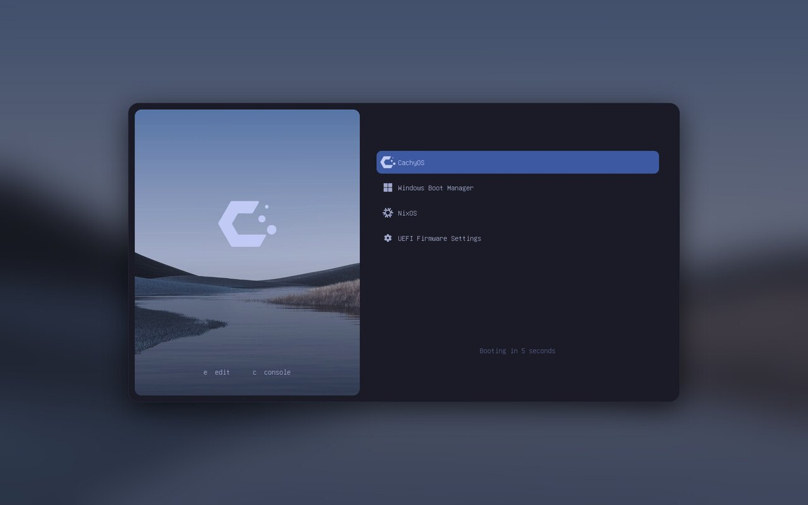
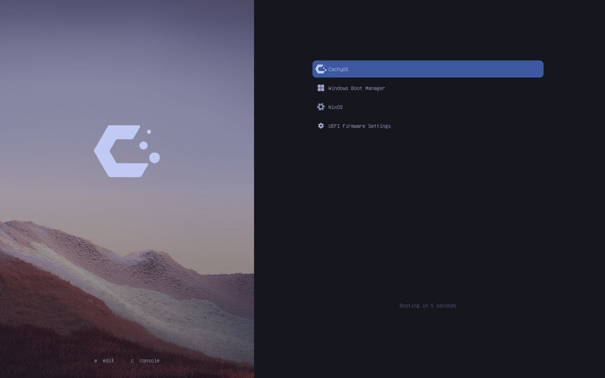
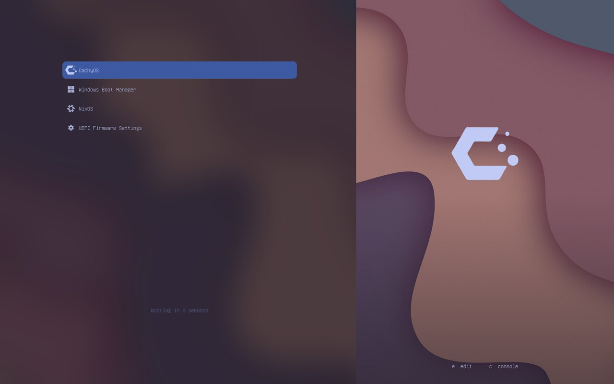
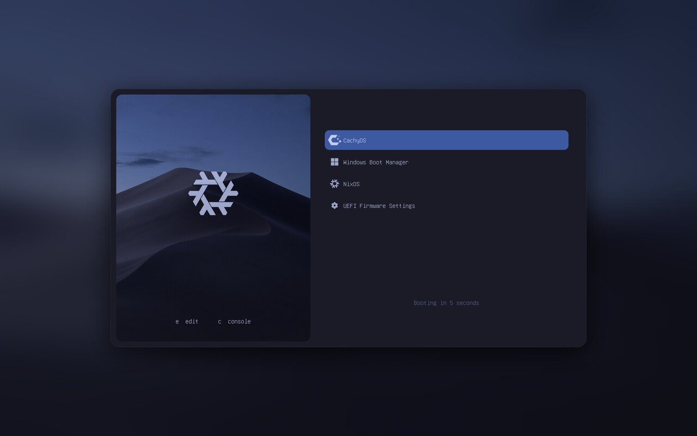

# Elegant GRUB - Tokyo Night

GRUB theme using the [Tokyo Night](https://github.com/folke/tokyonight.nvim) palette, derived from vinceliuice's [Elegant-grub2-themes](https://github.com/vinceliuice/Elegant-grub2-themes) (GPL-3.0). It retains Elegant's layout, with a photo on one side and the menu on the other, but the background, selector, and `theme.txt` are no longer pre-rendered images: they are generated at the exact resolution of the screen, using palette colors and the photo of your choice.

## What changes compared to Elegant

- **Single palette**: Tokyo Night in the Night variant, defined in `tools/palette.py`. The forest, mojave, mountain, and wave themes no longer exist as color styles, nor do light variants exist. Photos remain selectable content and are color-graded towards the palette.
- **Native resolution**: each display gets its own background, without scaling. Supported resolutions are `1080p`, `1440p`, `1600p` (2560x1600, 16:10 displays), and `4k`. In Elegant, the `2k` variant was drawn at 1.5x (2880x1620) but intended for 2560x1440, causing the panel to overflow the screen, and 16:10 displays were not supported.
- **Reproducible build**: assets are generated using Python and Pillow (`tools/build.py`), without Inkscape. The installed theme always matches the selected options.
- **Safe installation**: the script validates the theme before installing it, never replaces directories it did not create, and if anything fails, rolls GRUB back to its previous state (see [Installation safety](#installation-safety)).
- **NixOS**: the flake module remains, updated for the new options.
- **CachyOS icon** and configurable logo, alongside the icons from Elegant.

## Previews

| `window`, photo on left | `sharp`, photo on left |
| --- | --- |
|  |  |

| `blur`, photo on right | `window` with NixOS logo |
| --- | --- |
|  |  |

There are four styles: `window` (centered card on a blurred background), `float` (photo panel detached from the edges), `sharp` (full-height photo), and `blur` (full-height photo, menu on a blurred background). Previews are 2560x1600 screen simulations produced by `tools/preview.py`; real GRUB rendering uses the Unifont font, with minor differences in text rendering.

## Requirements

- GRUB 2 with a graphical terminal (`GRUB_TERMINAL_OUTPUT` not set to `console`; the script fixes this automatically)
- `python3` and Pillow. On Arch and CachyOS: `sudo pacman -S python-pillow`
- The display must be one of the supported resolutions; otherwise `1080p` works everywhere, but the image will be scaled by GRUB

## Installation

```sh
git clone https://github.com/<user>/grub-tokyonight && cd grub-tokyonight
sudo ./install.sh --dry-run        # build and validate theme without touching the system
sudo ./install.sh                  # auto-detect resolution, window style
sudo ./install.sh -s 1600p -p blur -i right -f wave
sudo ./install.sh --remove         # remove the theme
```

| Option | Values | Default |
| --- | --- | --- |
| `-s`, `--screen` | `1080p`, `1440p`, `1600p`, `4k` | detected from screen, otherwise `1080p` |
| `-p`, `--type` | `window`, `float`, `sharp`, `blur` | `window` |
| `-i`, `--side` | `left`, `right` (photo side) | `left` |
| `-f`, `--photo` | name in `backgrounds/` or path to an image | `mountain` |
| `-l`, `--logo` | name in `assets/logos/` or `none` | `cachyos` |
| `-g`, `--grade` | `none`, `soft`, `full` (color grading photo towards palette) | `soft` |
| `-n`, `--dry-run` | build and validate, do not modify the system | |
| `-r`, `--remove` | remove the theme | |

The script copies the theme to `/boot/grub/themes/tokyonight` (or `/boot/grub2/themes/tokyonight`), sets `GRUB_THEME` and `GRUB_GFXMODE` in `/etc/default/grub`, and regenerates `grub.cfg`. The theme appears on the next reboot.

### Installation safety

- Arguments are validated before making any changes; photo and logo names cannot escape `backgrounds/` and `assets/logos/`.
- The theme is built in a temporary directory and validated (required files present, background image dimensions, fonts, icons, layout within screen boundaries). It replaces the installed theme only if validation succeeds.
- The script only replaces or removes directories containing its `.tokyonight-theme` marker.
- `grub.cfg` is generated into a temporary file and installed only if non-empty and containing the theme. If generation fails, `/etc/default/grub` is restored to its previous state and `grub.cfg` is left untouched.
- Backup copies: `/etc/default/grub.bak` (the version before the first installation) and `grub.cfg.pre-tokyonight` alongside `grub.cfg`.
- Single instance at a time (lock) and refusal to run on NixOS, where GRUB is configured declaratively.
- With the `DESTDIR` variable, the script operates on an alternate prefix and does not invoke GRUB: useful for testing and packaging.

`--remove` comments out `GRUB_THEME`, regenerates `grub.cfg`, and deletes the theme directory. `GRUB_GFXMODE` and the graphical terminal remain as configured; to return to the original configuration, use `/etc/default/grub.bak`.

## NixOS

The module requires [flakes](https://wiki.nixos.org/wiki/Flakes). Add the repository to inputs and the module to your system modules:

```nix
# flake.nix
{
  inputs = {
    nixpkgs.url = "github:nixos/nixpkgs/nixos-unstable";
    grub-tokyonight.url = "github:<user>/grub-tokyonight";
  };

  outputs = { nixpkgs, grub-tokyonight, ... }: {
    nixosConfigurations.my_host = nixpkgs.lib.nixosSystem {
      system = "x86_64-linux";
      modules = [
        ./configuration.nix
        grub-tokyonight.nixosModules.default
      ];
    };
  };
}
```

Then configure the theme alongside other GRUB options:

```nix
# configuration.nix
{
  boot.loader.grub = { /* ... */ };

  boot.loader.tokyonight-grub-theme = {
    enable = true;
    screen = "1600p";
    type = "window";
    side = "left";
    photo = "forest";            # name in backgrounds/, or ./background.jpg
    logo = "nixos";              # name in assets/logos/ or "none"
    grade = "soft";
  };
}
```

The module compiles the theme into the Nix store using `tools/build.py` and sets `boot.loader.grub.theme`, `splashImage`, `gfxmodeEfi`, and `gfxmodeBios`. Options are the same as the script: `enable`, `type`, `side`, `screen`, `photo`, `logo`, `grade`. If each system has its own GRUB and you chainload them (for example, CachyOS GRUB loading NixOS GRUB), each menu uses its own system theme: NixOS is configured here, while the other distribution is configured with `install.sh`.

The flake also exposes `packages.<system>.default` (the theme with default options), `checks.<system>.theme` for `nix flake check`, and a `devShell` with Python and Pillow.

## Customization

### Backgrounds

Place an image (jpg, png, or webp) in `backgrounds/` and use it with `-f name`, or pass the path directly. The photo is cropped to cover the panel and slightly darkened at the bottom to ensure key hints are readable. The panel is full screen height in `sharp` and `blur` styles, so for crisp results at 2560x1600, a photo of at least 1100x1600 is recommended. If it is smaller, the script warns and scales it up.

`-g soft` blends the photo with a monochrome version in the palette colors; `-g full` replaces it entirely; `-g none` leaves the photo as is. EXIF orientation, transparency, and unusual color modes are normalized.

### Icons and entry classes

GRUB selects the icon based on the entry's class. `os-prober` and `grub-mkconfig` usually assign the appropriate class; for manually written entries, use `--class`:

```
menuentry "Windows Boot Manager" --class windows --class os {
    insmod part_gpt
    insmod fat
    search --no-floppy --fs-uuid --set=root <ESP-UUID>
    chainloader /EFI/Microsoft/Boot/bootmgfw.efi
}
```

Classes with icons: `cachyos`, `arch`, `windows`, `nixos`, `debian`, `ubuntu`, `fedora`, `efi`, and the others in `assets/icons.txt`. The `unknown` icon is included for entries without a recognized class.

To add or modify an icon: edit `assets/icons.svg`, add the ID to `assets/icons.txt`, and regenerate with `python3 tools/make-icons.py`. The script renders SVGs with Chromium via Playwright and therefore requires Node, the `playwright` module, and an installed Chromium (`NODE_PATH` must point to global Node modules if Playwright is installed globally). Icons in the repository are already pre-rendered in `assets/icons/<px>/`.

### Logo

Available logos in `assets/logos/` are `cachyos`, `nixos`, `arch`, `linux`, and `windows`: square white PNGs, tinted with the text color during build. To add one, simply provide a square `name.png` file and use `-l name`.

### Palette

All colors are in `tools/palette.py`: card background `#1a1b26`, screen background `#16161e`, borders `#292e42`, text `#c0caf5` and `#a9b1d6`, secondary text `#565f89`, accent `#7aa2f7`, selection `#3d59a1`. Editing them and rebuilding is sufficient; the Storm variant (background `#24283b`) is obtained by changing `bg`.

### Fonts

Fonts are `.pf2` files in `common/`, generated from Unifont with `common/makefont.sh` (requires `grub-mkfont`). The chosen size depends on resolution: 16 for `1080p`, 24 for `1440p` and `1600p`, 32 for `4k`.

## Development and testing

```sh
python3 tools/build.py /tmp/theme -s 1600p -p window -f forest   # build without installing
python3 tools/preview.py /tmp/theme preview.png -s 1600p        # simulate screen
python3 -m unittest discover -s tests -v                        # tests
```

The tests compile all 32 combinations of resolution, style, and side, test abnormal photos (transparency, thumbnails, portrait orientation, corrupt files), verify that names and paths cannot escape intended directories, and test the installer in `DESTDIR` mode, including removal, reinstallation, and protection of foreign directories. The same tests run on GitHub Actions on every push.

The logic is divided into `tools/palette.py` (colors), `tools/layout.py` (geometry and `theme.txt`), `tools/build.py` (composition and atomic installation), and `tools/validate.py` (checks on the compiled theme). To follow upstream updates: `git remote add upstream https://github.com/vinceliuice/Elegant-grub2-themes`.

## Troubleshooting

- **Theme does not appear**: check in `/etc/default/grub` that `GRUB_THEME` points to `/boot/grub/themes/tokyonight/theme.txt` and that `GRUB_TERMINAL_OUTPUT` is not `console`. If `/boot` is on a volume that GRUB cannot read, the theme must be located where GRUB can access it.
- **Incorrect resolution**: from the GRUB menu press `c`, run `videoinfo`, choose a supported mode, and set it in `GRUB_GFXMODE` (for example `2560x1600,auto`), then `sudo grub-mkconfig -o /boot/grub/grub.cfg`. The layout uses percentage positions: if GRUB falls back to another resolution, the theme remains usable but not aligned.
- **Missing icon**: the entry does not have a recognized class; add `--class name` to the entry.
- **Broken display**: the menu remains keyboard-operable even if graphics are corrupted. To revert, boot a live system (or another installed system) and restore `/etc/default/grub.bak` and `grub.cfg.pre-tokyonight`, or use `./install.sh --remove`.

## Repository structure

```
install.sh           installer for distributions with GRUB
flake.nix            NixOS module, package, check, and devShell
tools/               build, layout, palette, validation, previews, icon rendering
assets/icons/        pre-rendered icons for 32, 48, and 64 px
assets/icons.svg     source for icons, with list in icons.txt
assets/logos/        white PNG logos (cachyos, nixos, arch, linux, windows)
backgrounds/         source photos
common/              pf2 fonts and related script
preview/             previews used in this file
tests/               builder and installer tests
```

## Credits and license

This project is derived from vinceliuice's [Elegant-grub2-themes](https://github.com/vinceliuice/Elegant-grub2-themes) and inherits its GPL-3.0 license (see `LICENSE`). The CachyOS icon comes from the [CachyOS GRUB theme](https://github.com/diegons490/cachyos-grub-theme) (GPL-3.0). Photos in `backgrounds/` are from the original project. Palette: [Tokyo Night](https://github.com/folke/tokyonight.nvim) by folke. Theme format references: [reference](https://wiki.rosalab.ru/en/index.php/Grub2_theme_/_reference) and [tutorial](https://wiki.rosalab.ru/en/index.php/Grub2_theme_tutorial).
